# My Excel project
This project aims to improve my excel skills.
## Salary Dashbord
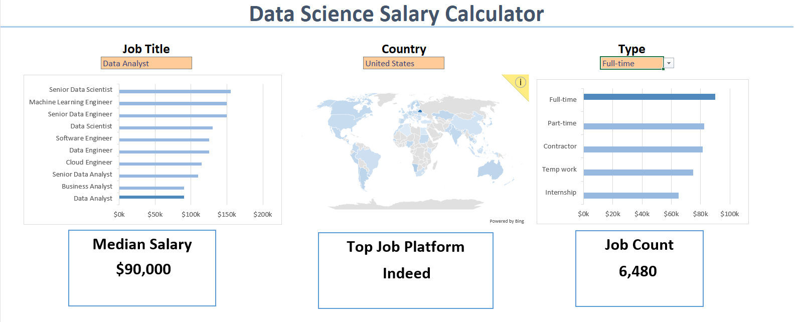
### Introduction
This data jobs salary dashboard was created to help job seekers investigate salaries for their desired jobs and ensure they are being adequately compensated.

### Skills I used
- Charts
- Formulars and functions
- Data Validation
### Dataset
The dataset used for this project contains real-world data science job information from 2023,Originally sourced from
[datanerd](https://datanerd.tech/).

### Dashbord Build

#### 🔹**Chart**
**Data Science Job Salaries - Bar Chart**

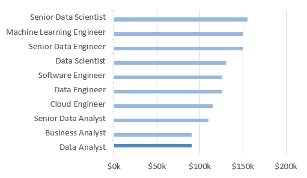
- _**Excel Features**_: Utilized bar chart feature (with formatted salary values) and optimized layout for clarity.
- _**Design Choice**_: Horizontal bar chart for visual comparison of median salaries.
- _**Data Organization**_: Sorted job titles by descending salary for improved readability.
- _**Insights Gained**_: This enables quick identification of salary trends, noting that Senior roles and Engineers are higher-paying than Analyst roles.

**Country Median Salaries - Map Chart**

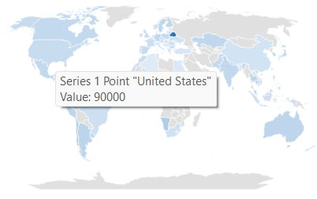

- _**Excel Features**_: Utilized Excel's map chart feature to plot median salaries globally.
- _**Design Choice**_: Color-coded map to visually differentiate salary levels across regions.
- _**Data Representation**_: Plotted median salary for each country with available data.
- _**Visual Enhancement**_: Improved readability and immediate understanding of geographic salary trends.
- _**Insights Gained**_: Enables quick grasp of global salary disparities and highlights high/low salary regions.

#### 🔹**Formulars and Functions**

**Median Salary by jobs title**
```excel
=MEDIAN(
    IF(
        (jobs[job_country] = country) *
        (jobs[salary_year_avg] <> 0) *
        (jobs[job_title_short] = A2) *
        (ISNUMBER(SEARCH(type, jobs[job_schedule_type]))),
        jobs[salary_year_avg]
    )
)
```

```jobs[job_country] = country ``` → filter jobs by selected country

```jobs[salary_year_avg] <> 0``` → ignore jobs with 0 salary

```jobs[job_title_short] = A2``` → filter by the job title in cell A2

```ISNUMBER(SEARCH(type, jobs[job_schedule_type]))``` → filter by schedule type (full-time, part-time, etc.)

```MEDIAN(...)``` → calculates the median of the filtered salaries

**Count of Job Schedule Type**
```excel
=FILTER(K2#,NOT(ISNUMBER(SEARCH("and",K2#)))*(K2#<>0))
```

```K2#``` → dynamic array of salary values

```ISNUMBER(SEARCH("and", K2#))``` → checks if the text "and" exists in each value

```NOT(...)``` → keeps only entries without "and"

```(K2# <> 0)``` → excludes any zero salaries

```*``` → logical AND, combining both conditions

```FILTER(...)``` → returns only the values that satisfy these conditions

#### 🔹**Data Validation**

To improve the usability and reliability of the dashboard, the **filtered list** is implemented as a **data validation rule** under the ```Job Title```, ```Country```, and ```Type``` options in the Data tab. This ensures:

-  **User input is restricted to predefined, validated schedule types**  
  Users can only select valid options, preventing mistakes from manual entry.

-  **Incorrect or inconsistent entries are prevented**  
  Reduces errors and ensures data consistency across the dashboard.

-  **Overall usability of the dashboard is enhanced**  
  Makes it easier for users to select options and keeps the dashboard clean and reliable.

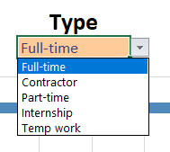


### Conclution
This dashboard showcases insights into salary trends across various data-related job titles. It allows users to explore how location and job type influence salaries and make informed career decisions. The dashboard also demonstrates skills in data analysis, visualization, and the use of formulas and data validation to extract meaningful insights.

## Salary Analyst

### Introduct

#### Question to Analyst
1. Do more skills get you better pay?
2. What’s the salary for data jobs in different regions?
3. What are the top skills of data professionals?
4. What’s the pay for the top 10 skills?

### Skills I used
- Pivot Tables
- Pivot Charts
- DAX (Data Analysis Expressions)
- Power Query
- Power Pivot

### Dataset
The dataset used for this project contains real-world data science job information from 2023,Originally sourced from
[datanerd](https://datanerd.tech/).
It includes detailed information on:

- Job titles
- Salaries
- Locations
- Skills

### 1. Do more skills get you better pay?

 **Extract** :
First used Power Query to extract the original data (```data_salary_all.xlsx```) and create two queries:

 - First one with all the data jobs information.

- The second listing the skills for each job ID.

**Transform** :
Then, I transformed each query by changing column types, removing unnecessary columns, cleaning text to eliminate specific words, and trimming excess whitespace.

**Data_jobs_all**
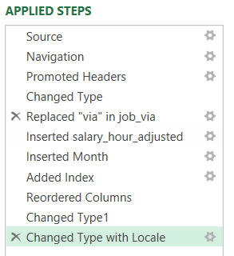

**Data_jobs_skills**
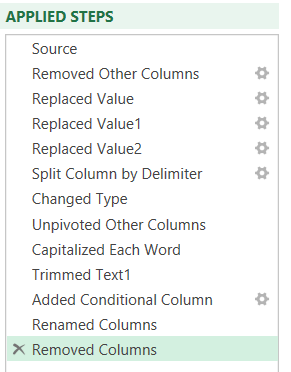

**Load** : 
Finally,loaded both transformed queries into the workbook, setting the foundation for my subsequent analysis.

**Analyst**

There is a positive correlation between the number of skills listed in job postings and median salary, especially for roles like Senior Data Engineer and Data Scientist. Roles requiring fewer skills, such as Business Analyst, tend to offer lower salaries, indicating that specialized skill sets command higher market value.

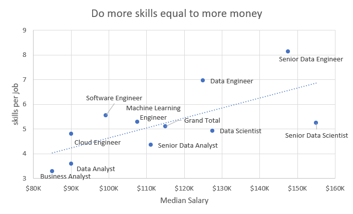


### 2. What’s the salary for data jobs in different regions?

**Pivot Table**

I created a PivotTable using the Data Model I created with Power Pivot.

I moved the ```job_title_short``` to the rows area and ```salary_year_avg``` into the values area.

Then I added new measure to calculate the median salary for Thailand jobs.
```excel
=CALCULATE(
    MEDIAN(data_jobs_all[salary_year_avg]),
    data_jobs_all[job_country] = "Thailand")
    
```
**DAX**
To calculate the median year salary I used DAX.

```excel
Median Salary := MEDIAN(data_jobs_all[salary_year_avg])
```
**Analyst**

Job roles like Senior Data Engineer and Data Scientist command higher median salaries both in Thailand and internationally, showcasing the global demand for high-level data expertise.

The median salary of Data Analysts in Thailand is noticeably higher compared to other countries, likely due to a combination of high demand for skilled data professionals, limited supply of experienced analysts, and rapid growth in data-driven industries within the country.

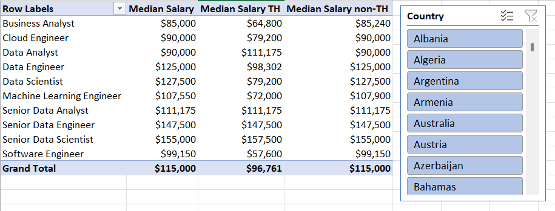

### 3. What are the top skills of data professionals?

**Data Model**

I created a relationship between my two tables using the job_id column.

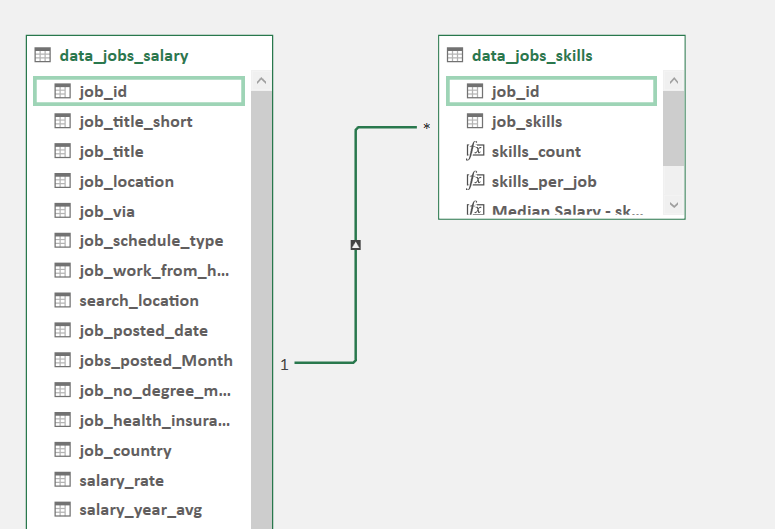

**Power Pivot Menu**

The Power Pivot menu was used to refine my data model and makes it easy to create measures.

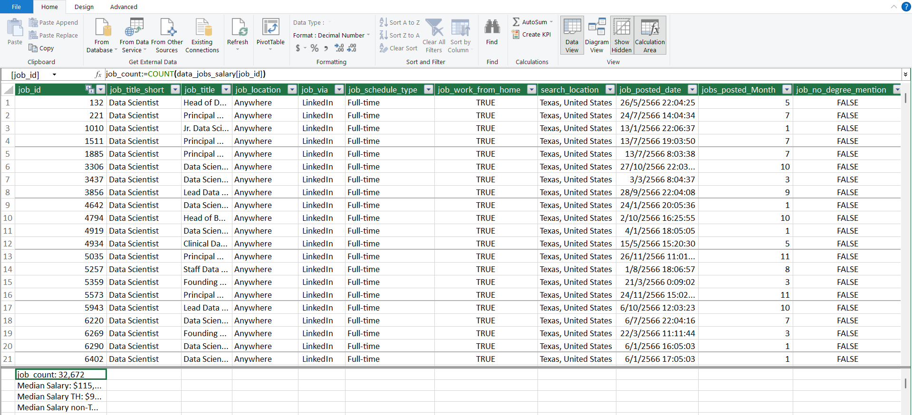

**Analyst**

SQL,Python and tableau dominate as top skills in data-related jobs,These three skills cover the core workflow: data extraction → analysis → visualization, making them highly valued in the job market.

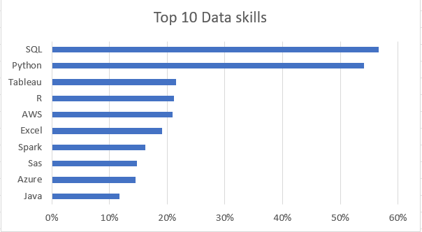

### 4. What’s the pay for the top 10 skills?

**PivotChart**:
I created a combo PivotChart to visualize the relationship between median salary and skill likelihood (%) based on my PivotTable:

- Primary Axis: Median Salary (Clustered Column)

- Secondary Axis: Skill Likelihood (Line with Markers)

Customized the chart by adding titles, adjusting markers to diamonds, and improving readability.

**Analyst**

Skills like Python and SQL are associated with the highest median salaries, highlighting their importance in high-paying tech roles.

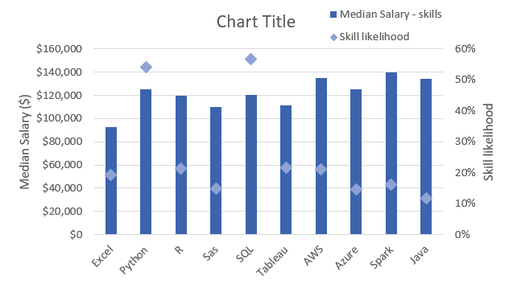

### Conclution
This project demonstrates how Excel tools like Power Query, Power Pivot, PivotTables, PivotCharts, and DAX can be used to analyze real-world data science job information. The analysis shows that more specialized skills generally lead to higher salaries, median salaries vary by region with Thailand showing notably higher pay for Data Analysts, and SQL, Python, and Tableau remain the most valuable skills in the job market. Overall, the dashboard provides actionable insights into career planning and the value of skill development in data-related roles.